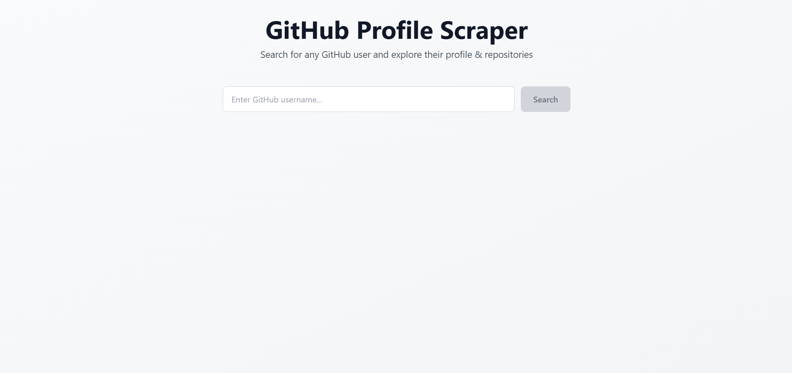
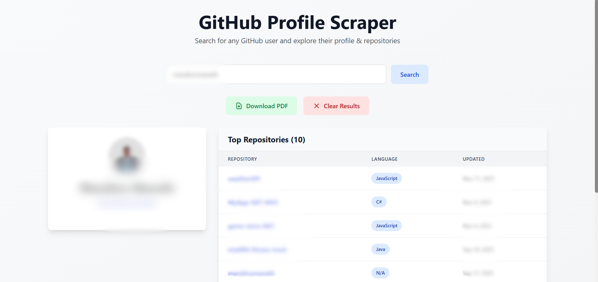
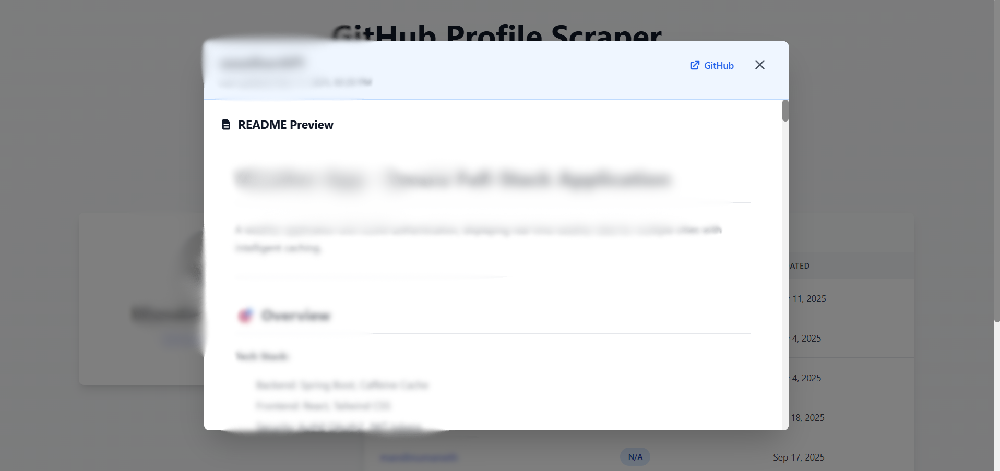
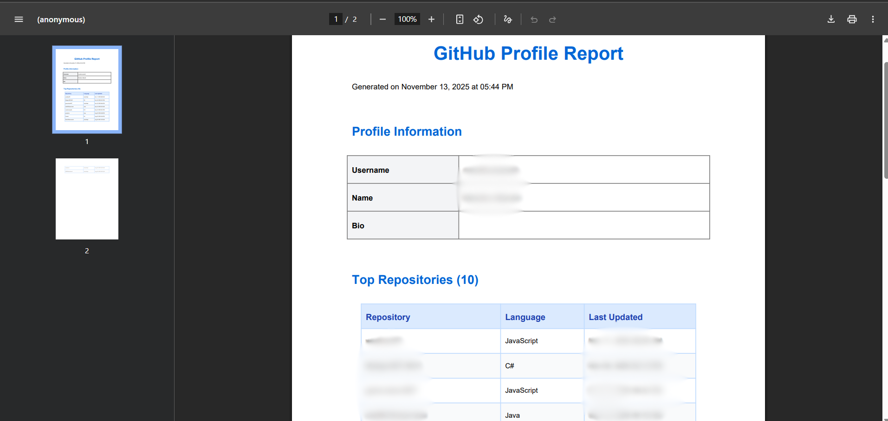

# GitHub Profile Scraper

<p align="center">
  
  
  
  
</p>

A full-stack web application that scrapes GitHub profiles and repositories, displays them in an elegant UI, and generates downloadable PDF reports.


## ✨ Features

### Core Functionality

- 🔍 **GitHub Profile Scraping** - Search and retrieve any public GitHub profile
- 📊 **Repository Display** - View user's top 10 repositories with detailed information
- 📄 **README Preview** - Click on repository names to view formatted README content in a modal
- 📥 **PDF Export** - Generate and download professional PDF reports of profiles
- 🎨 **Responsive Design** - Beautiful, mobile-friendly interface built with TailwindCSS
- 🔄 **Real-time Updates** - Instant data fetching and display

### UI/UX Features

- **Two-Column Layout**: Profile card on the left, repository table on the right
- **Modal README Viewer**: Click repository names to view full README with HTML rendering
- **Clean Profile Display**:
  - Centered profile image
  - Name and username vertically stacked
  - Conditional bio display
  - Location, company, and email information
- **Interactive Repository Table**:
  - Repository name (clickable)
  - Programming language
  - Last updated date with time
- **Action Buttons**:
  - Download PDF (light green)
  - Clear Results (light red)
  - Search (light blue)
- **Auto-clear Search**: Search input resets when clearing results

## 🛠️ Technologies Used

### Backend

- **FastAPI** (0.104.1) - Modern, fast web framework for building APIs
- **Python** (3.13) - Core programming language
- **BeautifulSoup4** (4.12.2) - HTML parsing and web scraping
- **Requests** (2.31.0) - HTTP library for API calls and scraping
- **ReportLab** (4.4.4) - PDF generation
- **Markdown** (3.10) - Converting markdown to HTML
- **Uvicorn** - ASGI server for running FastAPI

### Frontend

- **React** (19.2.0) - UI library for building interactive interfaces
- **Vite** (7.2.2) - Fast build tool and development server
- **TailwindCSS** (3.4.18) - Utility-first CSS framework
- **ESLint** - Code linting and quality

## 🏗️ Architecture

### Backend Structure

```
backend/
├── main.py              # FastAPI application with endpoints
└── requirements.txt     # Python dependencies
```

**Endpoints:**

- `POST /scrape` - Scrapes GitHub profile and repositories
- `GET /readme/{username}/{repo}` - Fetches and converts README to HTML
- `POST /generate-pdf` - Generates PDF report

### Frontend Structure

```
frontend/
├── src/
│   ├── components/
│   │   ├── SearchBar.jsx      # Search input component
│   │   ├── ProfileCard.jsx    # User profile display
│   │   └── RepoTable.jsx      # Repository table with modal
│   ├── App.jsx                # Main application component
│   ├── main.jsx               # React entry point
│   └── index.css              # Global styles with prose classes
├── public/                    # Static assets
└── package.json               # Node dependencies
```

## 🚀 Getting Started

### Prerequisites

- Python 3.13 or higher
- Node.js 18 or higher
- npm or yarn

### Installation

1. **Clone the repository**

```bash
git clone https://github.com/mandinumaneth/webScrappingOne.git
cd webScrappingOne
```

2. **Backend Setup**

```bash
cd backend
pip install -r requirements.txt
```

3. **Frontend Setup**

```bash
cd frontend
npm install
```

### Running the Application

1. **Start the Backend Server**

```bash
cd backend
python main.py
```

Backend runs on: `http://localhost:8000`

2. **Start the Frontend Development Server**

```bash
cd frontend
npm run dev
```

Frontend runs on: `http://localhost:5173`

3. **Open your browser**
   Navigate to `http://localhost:5173`

## 📖 Usage Guide

### Searching for a Profile

1. Enter a GitHub username in the search bar
2. Click the "Search" button or press Enter
3. Wait for the profile and repositories to load

### Viewing README Files

1. Click on any repository name in the table
2. A modal will open displaying:
   - Repository name
   - Last updated date and time
   - Link to GitHub repository (top right)
   - Full README content (HTML formatted)
3. Scroll through the README content
4. Click the X button to close

### Downloading PDF Reports

1. After loading a profile, click "Download PDF"
2. A PDF file will be generated and downloaded containing:
   - Profile information (name, username, bio, location, company, email)
   - Repository table (name, language, last updated)

### Clearing Results

1. Click "Clear Results" to reset the application
2. Profile, repositories, and search input will all be cleared

## 🎨 Design Features

### Profile Card

- **Layout**: Vertical, center-aligned
- **Components**:
  - Profile image (96px × 96px, circular)
  - Name (bold, large)
  - Username (clickable link to GitHub)
  - Bio (if available)
  - Location, company, email with icons

### Repository Table

- **Columns**: Repository, Language, Last Updated
- **Features**:
  - Clickable repository names
  - Color-coded languages
  - Formatted dates
  - Hover effects

### Modal

- **Header**: Light blue background with:
  - Repository name
  - Last updated date/time
  - GitHub link (top right)
  - Close button (X)
- **Body**: README content with prose styling
- **Single scrollbar** for smooth navigation

### Color Scheme

- **Search Button**: Light blue (`bg-blue-100`)
- **Download Button**: Light green (`bg-green-100`)
- **Clear Button**: Light red (`bg-red-100`)
- **Modal Header**: Light blue (`bg-blue-50`)

## 🔧 Technical Implementation

### Web Scraping Logic

1. **Profile Scraping**: Uses BeautifulSoup to parse GitHub profile pages
2. **Repository Data**: Extracts top 10 repositories with metadata
3. **README Fetching**:
   - Primary: GitHub API for structured data
   - Fallback: Direct page scraping if API fails
4. **Markdown Processing**: Converts markdown to HTML using Python markdown library

### State Management

- React useState for component state
- Key-based component reset for clearing search input
- Conditional rendering based on data availability

### Responsive Design

- CSS Grid for two-column layout (3-column grid system)
- Profile card: 1/3 width (lg:col-span-1)
- Repository table: 2/3 width (lg:col-span-2)
- Mobile: Stacks vertically (grid-cols-1)

### PDF Generation

- ReportLab for document creation
- Custom formatting matching UI layout
- Includes all displayed profile information
- Excludes followers/following, stars, forks, and descriptions

## 🔐 Error Handling

- **User Not Found**: Displays error message if GitHub user doesn't exist
- **Network Errors**: Catches and displays connection issues
- **README Loading**: Shows loading spinner and handles missing READMEs
- **PDF Generation**: Alert on failure with error details

## 🌟 Key Highlights

- ✅ **Clean, Modern UI** - Minimalist design with TailwindCSS
- ✅ **Fast Performance** - Vite for instant HMR, FastAPI for quick responses
- ✅ **No External Database** - All data fetched on-demand
- ✅ **Markdown Support** - Full README rendering with HTML conversion
- ✅ **Professional PDFs** - High-quality report generation
- ✅ **Mobile Friendly** - Responsive design works on all devices

## 📝 API Reference

### Scrape Profile

```http
POST /scrape
Content-Type: application/json

{
  "username": "string"
}
```

**Response:**

```json
{
  "profile": {
    "username": "string",
    "name": "string",
    "avatar": "string",
    "bio": "string",
    "location": "string",
    "company": "string",
    "email": "string"
  },
  "repos": [
    {
      "name": "string",
      "url": "string",
      "language": "string",
      "updated": "string"
    }
  ]
}
```

### Get README

```http
GET /readme/{username}/{repo}
```

**Response:**

```json
{
  "content": "string (HTML)",
  "html_url": "string"
}
```

### Generate PDF

```http
POST /generate-pdf
Content-Type: application/json

{
  "username": "string",
  "profile": {...},
  "repos": [...]
}
```

**Response:** PDF file (application/pdf)


---
